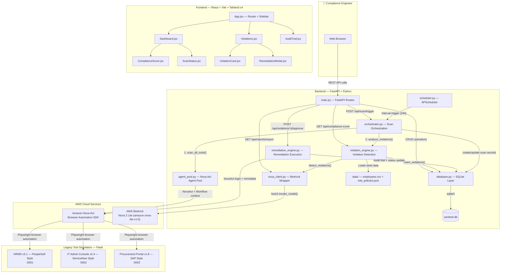
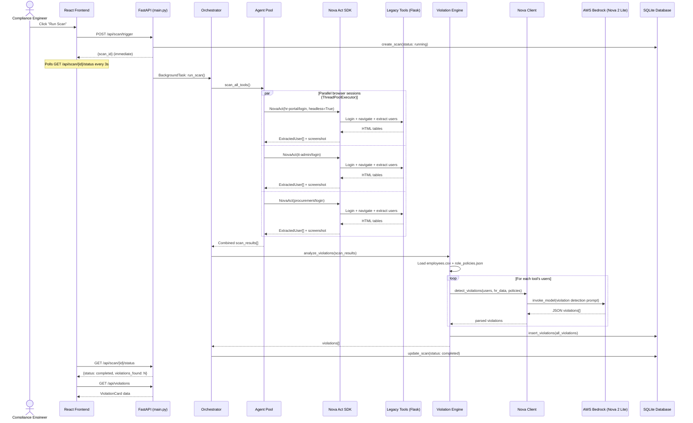
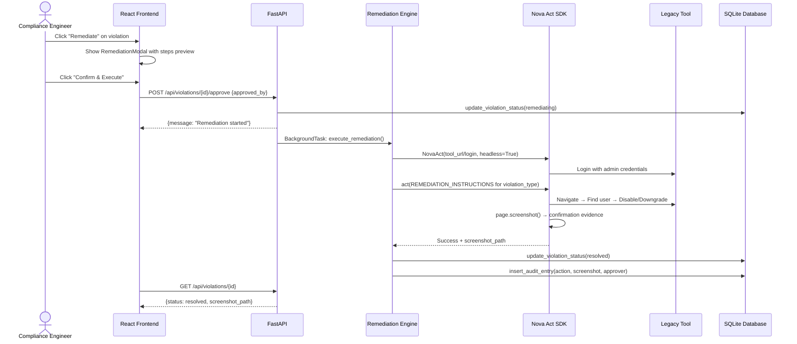
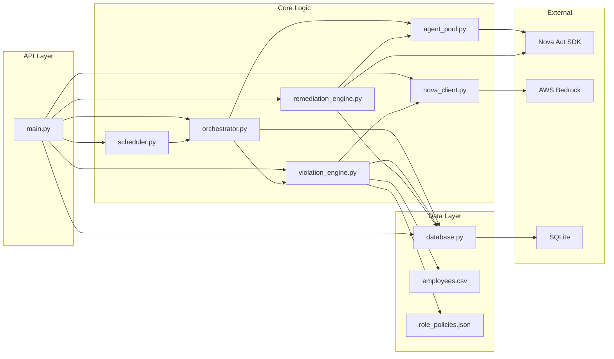
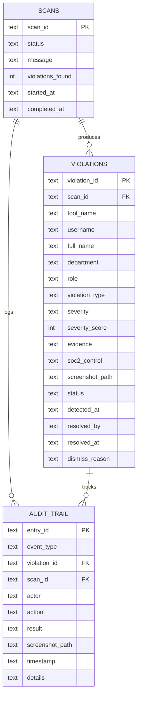
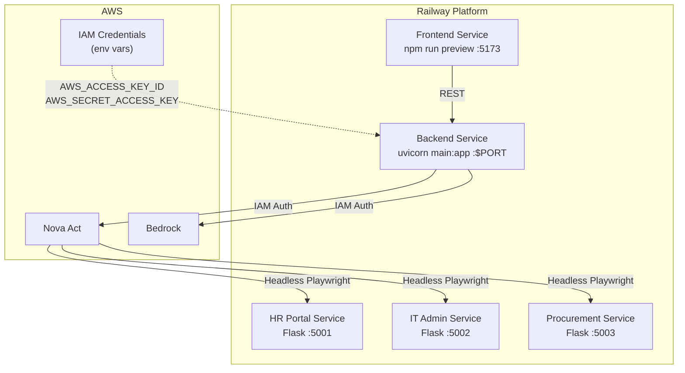

# Sentinel — Architecture Diagram

## High-Level System Architecture

---

## Data Flow: Compliance Scan Lifecycle

---

## Data Flow: Remediation Execution

---

## Module Dependency Graph

---

## API Endpoint Map

| Method | Endpoint | Handler | Description |
|--------|----------|---------|-------------|
| `POST` | `/api/scan/trigger` | [trigger_scan()](file:///d:/Amazon/sentinel/backend/main.py#112-140) | Starts background scan, returns `scan_id` |
| `GET` | `/api/scan/{scan_id}/status` | [get_scan_status()](file:///d:/Amazon/sentinel/backend/main.py#183-190) | Poll scan progress |
| `GET` | `/api/violations` | [list_violations()](file:///d:/Amazon/sentinel/backend/main.py#197-212) | Filter by severity/tool/status |
| `GET` | `/api/violations/{id}` | [get_violation()](file:///d:/Amazon/sentinel/backend/database.py#176-186) | Single violation detail |
| `POST` | `/api/violations/{id}/approve` | [approve_remediation()](file:///d:/Amazon/sentinel/backend/main.py#223-247) | Trigger Nova Act remediation |
| `POST` | `/api/violations/{id}/dismiss` | [dismiss_violation()](file:///d:/Amazon/sentinel/backend/main.py#273-311) | Dismiss with reason |
| `GET` | `/api/audit-trail` | [get_audit_trail()](file:///d:/Amazon/sentinel/backend/database.py#227-237) | Full event history |
| `GET` | `/api/compliance-score` | [get_compliance_score()](file:///d:/Amazon/sentinel/backend/main.py#329-333) | Score + severity breakdown |
| `GET` | `/api/reports/export` | [export_report()](file:///d:/Amazon/sentinel/backend/main.py#459-485) | PDF download via Nova 2 Lite |
| `GET` | `/health` | [health()](file:///d:/Amazon/sentinel/backend/main.py#492-495) | Health check |

---

## Database Schema

---

## Deployment Topology (Railway)

---

## Violation Types & Severity

| Type | Severity | Score | SOC2 Control | Detection Logic |
|------|----------|-------|--------------|-----------------|
| `ACCESS_VIOLATION` | CRITICAL | 95 | CC6.2 | TERMINATED in HR but active in tool |
| `INACTIVE_ADMIN` | HIGH | 75 | CC6.1 | Admin, last login >90 days ago |
| `SHARED_ACCOUNT` | HIGH | 70 | CC6.3 | Username matches shared patterns + has admin |
| `PERMISSION_CREEP` | MEDIUM | 50 | CC6.3 | Never-admin role but has admin access |
