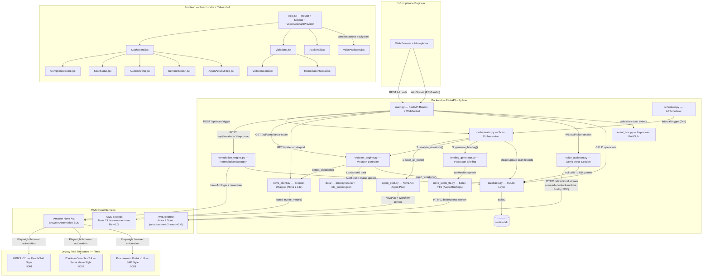
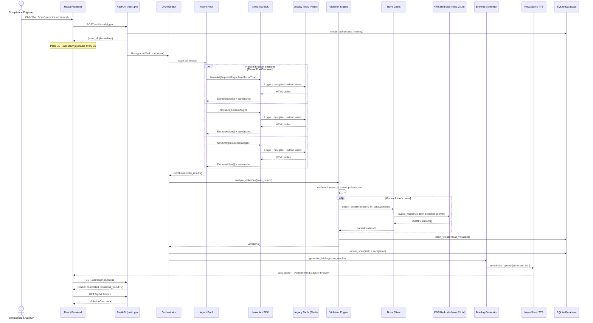
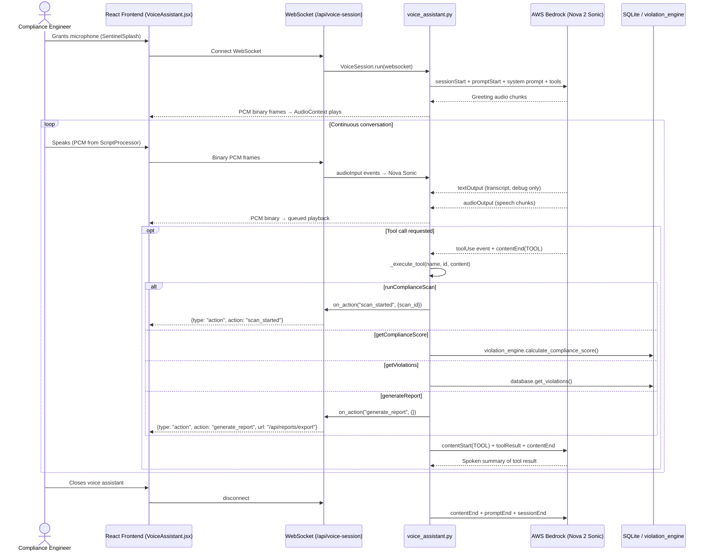
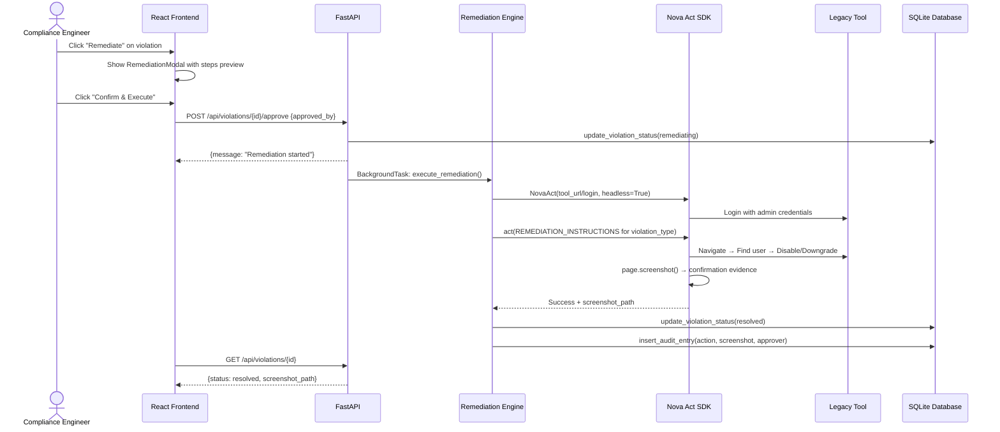
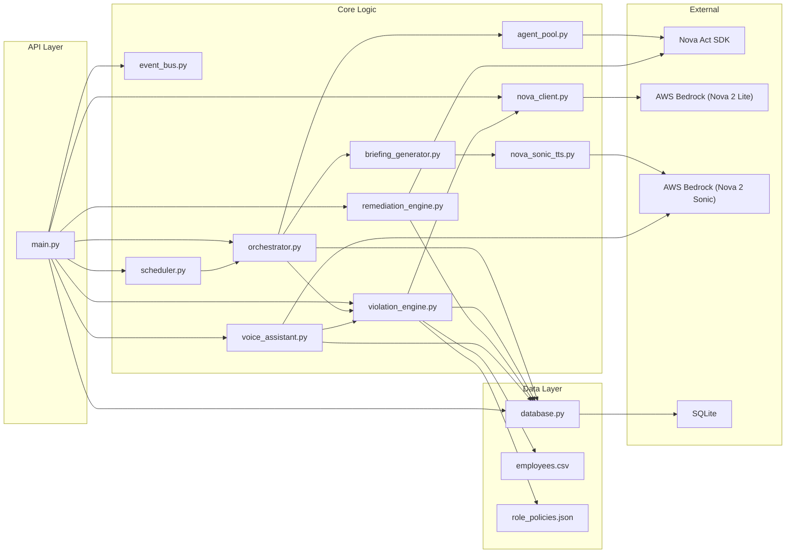
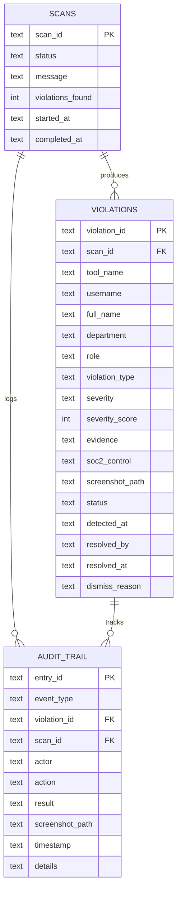
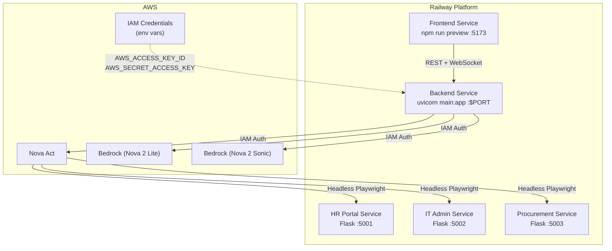

# Sentinel — Architecture Diagram

## High-Level System Architecture

---

## Data Flow: Compliance Scan Lifecycle

---

## Data Flow: Voice Assistant Session

---

## Data Flow: Remediation Execution

---

## Module Dependency Graph

---

## API Endpoint Map

| Method | Endpoint | Handler | Description |
|--------|----------|---------|-------------|
| `POST` | `/api/scan/trigger` | `trigger_scan()` | Starts background scan, returns `scan_id` |
| `GET` | `/api/scan/{scan_id}/status` | `get_scan_status()` | Poll scan progress |
| `GET` | `/api/violations` | `list_violations()` | Filter by severity/tool/status |
| `GET` | `/api/violations/{id}` | `get_violation()` | Single violation detail |
| `POST` | `/api/violations/{id}/approve` | `approve_remediation()` | Trigger Nova Act remediation |
| `POST` | `/api/violations/{id}/dismiss` | `dismiss_violation()` | Dismiss with reason |
| `GET` | `/api/audit-trail` | `get_audit_trail()` | Full event history |
| `GET` | `/api/compliance-score` | `get_compliance_score()` | Score + severity breakdown |
| `GET` | `/api/reports/export` | `export_report()` | PDF download via Nova 2 Lite |
| `WS` | `/api/voice-session` | `voice_session()` | Nova 2 Sonic bidirectional voice stream |
| `GET` | `/health` | `health()` | Health check |

---

## Database Schema

---

## Deployment Topology (Railway)

---

## Violation Types & Severity

| Type | Severity | Score | SOC2 Control | Detection Logic |
|------|----------|-------|--------------|-----------------|
| `ACCESS_VIOLATION` | CRITICAL | 95 | CC6.2 | TERMINATED in HR but active in tool |
| `INACTIVE_ADMIN` | HIGH | 75 | CC6.1 | Admin, last login >90 days ago |
| `SHARED_ACCOUNT` | HIGH | 70 | CC6.3 | Username matches shared patterns + has admin |
| `PERMISSION_CREEP` | MEDIUM | 50 | CC6.3 | Never-admin role but has admin access |
