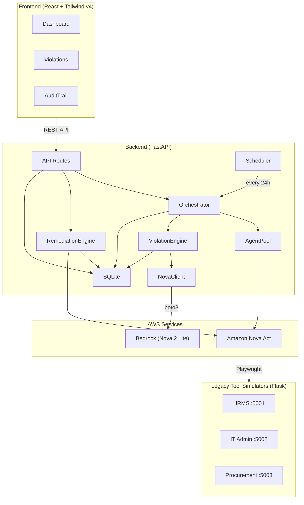

<p align="center">
  <h1 align="center">🛡️ Sentinel</h1>
  <p align="center">
    <strong>Autonomous Compliance Monitoring Platform</strong><br/>
    Detect SOC2 / HIPAA / GDPR violations across legacy enterprise tools — powered by Amazon Nova Act &amp; Nova 2 Lite
  </p>
</p>

<p align="center">
  
  
  
  
  
</p>

---

## What Is Sentinel?

Sentinel is an autonomous compliance monitoring platform that:

1. **Scans** legacy enterprise web UIs (HRMS, IT Admin, Procurement) using **Amazon Nova Act** browser automation — no API integrations needed.
2. **Detects** SOC2/HIPAA/GDPR violations by comparing extracted user/permission data against HR source-of-truth via **Amazon Nova 2 Lite** (AWS Bedrock).
3. **Remediates** approved violations autonomously — Nova Act logs back in and disables accounts or revokes privileges, capturing screenshot evidence.
4. **Audits** every action with timestamps, approvers, and screenshot proof for compliance audit trails.

> **Demo-ready**: Ships with three fake legacy tool simulators (Flask apps styled after PeopleSoft, ServiceNow, and SAP) pre-seeded with compliance violations.

---

## Architecture

```
sentinel/
├── backend/                 # FastAPI + Python
│   ├── main.py              # API routes (10 endpoints)
│   ├── orchestrator.py      # Scan coordination
│   ├── agent_pool.py        # Nova Act parallel browser sessions
│   ├── violation_engine.py  # Nova 2 Lite violation detection
│   ├── remediation_engine.py# Nova Act remediation execution
│   ├── nova_client.py       # AWS Bedrock wrapper
│   ├── scheduler.py         # APScheduler daily scans
│   ├── database.py          # SQLite operations
│   └── data/
│       ├── employees.csv    # HR source of truth (8 employees)
│       └── role_policies.json
│
├── frontend/                # React + Vite + Tailwind v4
│   └── src/
│       ├── pages/           # Dashboard, Violations, AuditTrail
│       └── components/      # ComplianceScore, ViolationCard, RemediationModal, ScanStatus
│
├── legacy-tools/            # 3 Flask apps (fake enterprise UIs)
│   ├── hr-portal/           # PeopleSoft HCM style  (:5001)
│   ├── it-admin/            # ServiceNow style      (:5002)
│   └── procurement/         # SAP SRM style         (:5003)
│
└── .env.example
```



---

## Violation Types

| Type | Severity | SOC2 | Trigger |
|------|----------|------|---------|
| `ACCESS_VIOLATION` | 🔴 CRITICAL | CC6.2 | Terminated employee still has active access |
| `INACTIVE_ADMIN` | 🟠 HIGH | CC6.1 | Admin account unused for 90+ days |
| `SHARED_ACCOUNT` | 🟠 HIGH | CC6.3 | Shared/generic account with admin privileges |
| `PERMISSION_CREEP` | 🟡 MEDIUM | CC6.3 | Role should never have admin (e.g. Intern) |

**Compliance Score**: Starts at 100. Deductions per open violation: CRITICAL −15, HIGH −8, MEDIUM −4.

---

## Prerequisites

- **Python 3.11+**
- **Node.js 18+** and npm
- **AWS Account** with IAM credentials that have access to:
  - Amazon Nova Act
  - AWS Bedrock (model: `amazon.nova-lite-v1:0`)
- **Playwright browsers** (`playwright install`)

---

## Quick Start

### 1. Clone & configure environment

```bash
cd sentinel
cp .env.example .env
# Edit .env — fill in your AWS credentials
```

### 2. Start the Legacy Tool Simulators

```bash
pip install -r legacy-tools/requirements.txt

# In 3 separate terminals:
python legacy-tools/hr-portal/app.py        # → http://localhost:5001
python legacy-tools/it-admin/app.py         # → http://localhost:5002
python legacy-tools/procurement/app.py      # → http://localhost:5003
```

Each tool has a login page (credentials: `admin` / `admin123`) and pre-seeded user data with embedded violations.

### 3. Start the Backend

```bash
pip install -r backend/requirements.txt
playwright install

cd backend
uvicorn main:app --reload --port 8000
```

The API is available at **http://localhost:8000** with interactive docs at `/docs`.

### 4. Start the Frontend

```bash
cd frontend
npm install
npm run dev
```

Open **http://localhost:5173** — the Sentinel dashboard.

### 5. Run your first scan

Click **"Run Scan"** on the dashboard, or via the API:

```bash
# Trigger scan
curl -X POST http://localhost:8000/api/scan/trigger
# → {"scan_id": "..."}

# Poll status
curl http://localhost:8000/api/scan/<scan_id>/status

# View results
curl http://localhost:8000/api/violations
```

---

## API Reference

| Method | Endpoint | Description |
|--------|----------|-------------|
| `POST` | `/api/scan/trigger` | Start a compliance scan (background) |
| `GET` | `/api/scan/{id}/status` | Poll scan progress |
| `GET` | `/api/violations` | List violations (`?severity=` `?tool=` `?status=`) |
| `GET` | `/api/violations/{id}` | Single violation detail |
| `POST` | `/api/violations/{id}/approve` | Approve & execute remediation |
| `POST` | `/api/violations/{id}/dismiss` | Dismiss with reason |
| `GET` | `/api/audit-trail` | Full audit history |
| `GET` | `/api/compliance-score` | Score + breakdown |
| `GET` | `/api/reports/export` | Download PDF audit report |
| `GET` | `/health` | Health check |

---

## Environment Variables

| Variable | Required | Default | Description |
|----------|----------|---------|-------------|
| `AWS_ACCESS_KEY_ID` | ✅ | — | IAM key for Nova Act + Bedrock |
| `AWS_SECRET_ACCESS_KEY` | ✅ | — | IAM secret |
| `AWS_DEFAULT_REGION` | — | `us-east-1` | AWS region |
| `NOVA_ACT_WORKFLOW_NAME` | — | `sentinel-scan` | Nova Act workflow name |
| `HRMS_URL` | — | `http://localhost:5001` | HR portal URL |
| `ITADMIN_URL` | — | `http://localhost:5002` | IT admin URL |
| `PROCUREMENT_URL` | — | `http://localhost:5003` | Procurement URL |
| `SCAN_INTERVAL_HOURS` | — | `24` | Auto-scan interval |
| `FRONTEND_URL` | — | `http://localhost:5173` | CORS origin |

---

## Deployment (Railway)

Each component deploys as a separate Railway service:

```bash
# Backend
railway init
railway up --service sentinel-backend

# Frontend (build first)
cd frontend && npm run build
railway up --service sentinel-frontend

# Legacy tools (one service each)
railway up --service hr-portal
railway up --service it-admin
railway up --service procurement
```

After deploying, update `.env` with the public Railway URLs for `HRMS_URL`, `ITADMIN_URL`, `PROCUREMENT_URL`, and `FRONTEND_URL`.

---

## Tech Stack

| Layer | Technology |
|-------|------------|
| **Frontend** | React 18, Vite 5, Tailwind CSS v4, Recharts, Lucide Icons |
| **Backend** | FastAPI, Uvicorn, Pydantic, APScheduler, FPDF2 |
| **Browser Automation** | Amazon Nova Act SDK, Playwright |
| **AI / LLM** | Amazon Nova 2 Lite via AWS Bedrock |
| **Database** | SQLite (built-in `sqlite3`) |
| **Legacy Simulators** | Flask (server-rendered HTML) |
| **Deployment** | Railway |

---

## License

This project is part of an Amazon Nova Act demonstration. See the root [LICENSE](../nova-act/LICENSE) for the Nova Act SDK license terms.
