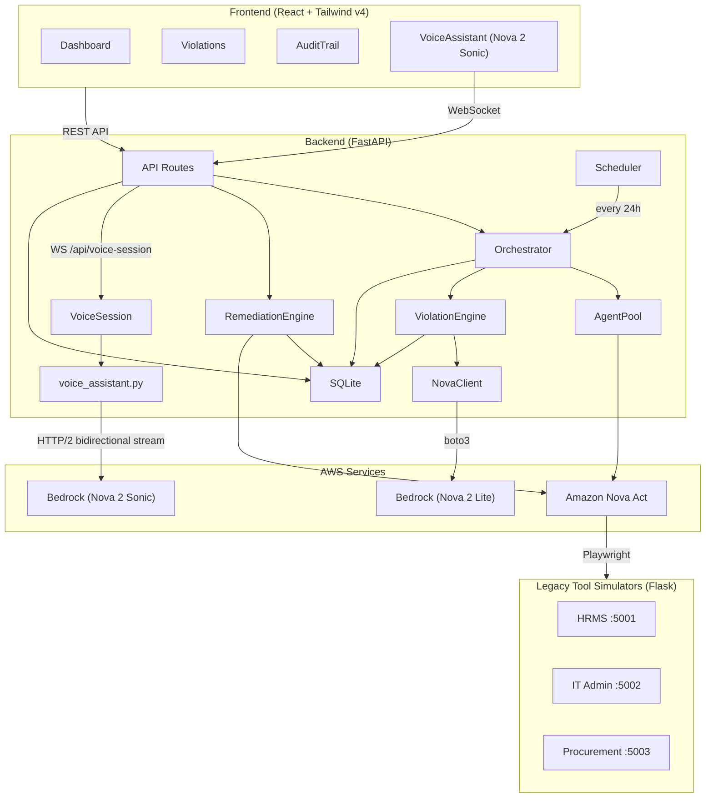
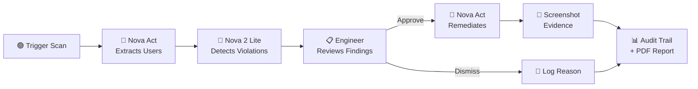

<p align="center">
  <h1 align="center">🛡️ Sentinel</h1>
  <p align="center">
    <strong>Autonomous Compliance Monitoring Platform</strong><br/>
    Detect SOC2 / HIPAA / GDPR violations across legacy enterprise tools — powered by Amazon Nova Act, Nova 2 Lite &amp; Nova 2 Sonic
  </p>
</p>

<p align="center">
  
  
  
  
  
</p>

---

## What Is Sentinel?

Sentinel is an autonomous compliance monitoring platform that:

1. **Scans** legacy enterprise web UIs (HRMS, IT Admin, Procurement) using **Amazon Nova Act** browser automation — no API integrations needed.
2. **Detects** SOC2/HIPAA/GDPR violations by comparing extracted user/permission data against HR source-of-truth via **Amazon Nova 2 Lite** (AWS Bedrock).
3. **Remediates** approved violations autonomously — Nova Act logs back in and disables accounts or revokes privileges, capturing screenshot evidence.
4. **Audits** every action with timestamps, approvers, and screenshot proof for compliance audit trails.
5. **Speaks** — a built-in voice assistant powered by **Amazon Nova 2 Sonic** lets engineers run scans, check scores, list violations, and generate reports hands-free via bidirectional audio streaming.

> **Demo-ready**: Ships with three fake legacy tool simulators (Flask apps styled after PeopleSoft, ServiceNow, and SAP) pre-seeded with compliance violations.

---

## Architecture — Please find the detailed diagram in ARCHITECTURE.md

```
sentinel/
├── backend/                    # FastAPI + Python
│   ├── main.py                 # API routes + WebSocket voice endpoint
│   ├── orchestrator.py         # Scan coordination
│   ├── agent_pool.py           # Nova Act parallel browser sessions
│   ├── violation_engine.py     # Nova 2 Lite violation detection
│   ├── remediation_engine.py   # Nova Act remediation execution
│   ├── nova_client.py          # AWS Bedrock wrapper (Nova 2 Lite)
│   ├── nova_sonic_tts.py       # Nova 2 Sonic TTS for audio briefings
│   ├── voice_assistant.py      # Nova 2 Sonic bidirectional voice session
│   ├── briefing_generator.py   # Post-scan briefing content generation
│   ├── event_bus.py            # In-process pub/sub for real-time updates
│   ├── scheduler.py            # APScheduler daily scans
│   ├── database.py             # SQLite operations
│   └── data/
│       ├── employees.csv       # HR source of truth
│       └── role_policies.json
│
├── frontend/                   # React + Vite + Tailwind v4
│   └── src/
│       ├── pages/              # Dashboard, Violations, AuditTrail
│       └── components/         # ComplianceScore, ViolationCard, RemediationModal,
│                               # ScanStatus, ScoreTrendChart, VoiceAssistant,
│                               # AudioBriefing, SentinelSplash, AgentActivityFeed
│
├── legacy-tools/               # 3 Flask apps (fake enterprise UIs)
│   ├── hr-portal/              # PeopleSoft HCM style  (:5001)
│   ├── it-admin/               # ServiceNow style      (:5002)
│   └── procurement/            # SAP SRM style         (:5003)
│
└── .env.example
```



---

## Violation Types

| Type | Severity | SOC2 | Trigger |
|------|----------|------|---------|
| `ACCESS_VIOLATION` | 🔴 CRITICAL | CC6.2 | Terminated employee still has active access |
| `INACTIVE_ADMIN` | 🟠 HIGH | CC6.1 | Admin account unused for 90+ days |
| `SHARED_ACCOUNT` | 🟠 HIGH | CC6.3 | Shared/generic account with admin privileges |
| `PERMISSION_CREEP` | 🟡 MEDIUM | CC6.3 | Role should never have admin (e.g. Intern) |

**Compliance Score**: Starts at 100. Deductions per open violation: CRITICAL −15, HIGH −8, MEDIUM −4. Score history is tracked per session and displayed as a trend chart on the dashboard.

---

## End-to-End Workflow



### Phase 1 — Scan Initiation

A compliance engineer clicks **"Run Scan"** on the dashboard (or asks the voice assistant, or the APScheduler triggers one automatically every 24 hours). The backend creates a scan record in SQLite with status `running` and kicks off the orchestrator as a background task. The API returns the `scan_id` immediately so the frontend can poll for progress.

### Phase 2 — Data Extraction (Nova Act)

The **Agent Pool** launches three headless Playwright browser sessions in parallel via `ThreadPoolExecutor`, one per legacy tool. Each session shares a single Nova Act `Workflow` context (AWS IAM authenticated). For each tool, Nova Act:

1. Navigates to the login page and enters credentials using `page.keyboard.type()` (SDK-recommended secure credential pattern)
2. Navigates to the user management page
3. Extracts all user records as structured JSON via `act_get()` with a Pydantic schema (`ExtractedUser`)
4. Captures a screenshot as evidence

### Phase 3 — Violation Analysis (Nova 2 Lite)

The **Violation Engine** loads the HR source-of-truth (`employees.csv`) and role policies (`role_policies.json`), then sends each tool's extracted users to **Amazon Nova 2 Lite** via AWS Bedrock. The LLM compares the live system data against HR records and policy rules to detect four violation types.

Violations are saved to SQLite with severity scores. The compliance score is recalculated (base 100, minus deductions per violation).

### Phase 4 — Audio Briefing (Nova 2 Sonic TTS)

After the scan completes, `briefing_generator.py` composes a natural-language summary. `nova_sonic_tts.py` synthesises it to speech via Nova 2 Sonic and the **AudioBriefing** component plays it in-browser. If the interactive voice session is already active, the briefing audio is muted automatically to avoid overlap.

### Phase 5 — Review & Action

The compliance engineer reviews violations on the **Violations page**, filtered by severity, tool, or status. For each violation they can:

- **Remediate** → opens a modal previewing exactly what Nova Act will do, then confirms execution
- **Dismiss** → logs a reason (e.g. "approved exception") and marks the violation as dismissed

### Phase 6 — Remediation Execution (Nova Act)

When a remediation is approved, the **Remediation Engine** launches a new Nova Act session targeting the specific legacy tool. It logs in, navigates to the user record, and executes the appropriate action (disable account, revoke admin, downgrade role). A confirmation screenshot is captured as proof.

### Phase 7 — Audit & Reporting

Every action is logged to the **audit trail** with timestamps, actor names, and screenshot paths. Both the audit trail and all report data are scoped to the **current session** — previous session data is never surfaced.

The engineer can export a professional **PDF audit report** as a structured 6-section SOC2 compliance document:

1. **Executive Summary** — prose overview generated by Nova 2 Lite
2. **Scope & Methodology** — tools audited, detection methods, date range
3. **Violations Detected** — per-violation detail with screenshots and detection narrative
4. **Compliance Score Analysis** — score calculation with severity deduction breakdown
5. **Remediation Summary** — automated remediation steps executed by Nova Act
6. **Recommendations** — risk-prioritised action items generated by Nova 2 Lite

---

## Dashboard Features

- **Compliance Score Trend Chart** — Recharts area chart showing score over the current session. Starts at 100 when a scan begins, drops as violations are detected, and recovers as remediations are approved. Color-coded: green ≥ 80, yellow ≥ 60, red < 60. Resets fresh on every backend restart.
- **SOC2 Control Tooltips** — On the Violations page, hovering over a control ID badge (e.g. `CC6.2`) shows a tooltip with the full SOC2 control description.
- **Session-scoped data** — Audit trail, violations, compliance score history, and PDF exports all reflect only the current backend session. No stale data from previous runs bleeds through.

---

## Voice Assistant

Sentinel includes a hands-free voice interface powered by **Amazon Nova 2 Sonic** via HTTP/2 bidirectional streaming.

**Capabilities** (tool calling, not text heuristics):

| Voice Command | Tool | Action |
|---|---|---|
| "Run a compliance scan" | `runComplianceScan` | Triggers scan, updates dashboard |
| "What's the compliance score?" | `getComplianceScore` | Returns score + open violation counts |
| "List all violations" | `getViolations` | Returns open violations with details |
| "Generate a report" | `generateReport` | Opens PDF export in new tab |

**How it works:**
- On first dashboard load, **SentinelSplash** prompts for microphone permission and creates the `AudioContext`.
- The `VoiceAssistantProvider` in `App.jsx` keeps the session alive across page navigation — the WebSocket to `/api/voice-session` never disconnects when switching tabs.
- `voice_assistant.py` manages the Nova Sonic session: sends PCM audio frames from the mic, receives synthesised speech chunks back, and executes tool calls when the model requests them.
- The `aws-sdk-bedrock-runtime` Smithy SDK is used (not boto3, which does not support HTTP/2 bidirectional streams). Credentials are bridged from boto3's full credential chain via `_BotoCredentialsResolver`.

---

## Prerequisites

- **Python 3.11+**
- **Node.js 18+** and npm
- **AWS Account** with IAM credentials that have access to:
  - Amazon Nova Act
  - AWS Bedrock (`amazon.nova-lite-v1:0` and `amazon.nova-2-sonic-v1:0`)
- **Playwright browsers** (`playwright install`)
- **`aws-sdk-bedrock-runtime`** Python package (`pip install aws-sdk-bedrock-runtime smithy-aws-core`)

---

## Quick Start

### 1. Clone & configure environment

```bash
cd sentinel
cp .env.example .env
# Edit .env — fill in your AWS credentials
```

### 2. Start the Legacy Tool Simulators

```bash
pip install -r legacy-tools/requirements.txt

# In 3 separate terminals:
python legacy-tools/hr-portal/app.py        # → http://localhost:5001
python legacy-tools/it-admin/app.py         # → http://localhost:5002
python legacy-tools/procurement/app.py      # → http://localhost:5003
```

Each tool has a login page (credentials: `admin` / `admin123`) and pre-seeded user data with embedded violations.

**Portal-specific columns visible to Nova Act:**

| Portal | Extra Columns Added |
|--------|---------------------|
| HR Portal (`:5001`) | Last Password Change |
| IT Admin Console (`:5002`) | Failed Login Attempts (red if > 3) |
| Procurement Portal (`:5003`) | Contract Expiry Date (red warning for expired) |

### 3. Start the Backend

```bash
pip install -r backend/requirements.txt
playwright install

cd backend
uvicorn main:app --reload --port 8000
```

The API is available at **http://localhost:8000** with interactive docs at `/docs`.

### 4. Start the Frontend

```bash
cd frontend
npm install
npm run dev
```

Open **http://localhost:5173** — the Sentinel dashboard.

### 5. Run your first scan

Click **"Run Scan"** on the dashboard, speak to the voice assistant, or via the API:

```bash
# Trigger scan
curl -X POST http://localhost:8000/api/scan/trigger
# → {"scan_id": "..."}

# Poll status
curl http://localhost:8000/api/scan/<scan_id>/status

# View results
curl http://localhost:8000/api/violations
```

---

## API Reference

| Method | Endpoint | Description |
|--------|----------|-------------|
| `POST` | `/api/scan/trigger` | Start a compliance scan (background) |
| `GET` | `/api/scan/{id}/status` | Poll scan progress |
| `GET` | `/api/violations` | List violations (`?severity=` `?tool=` `?status=`) |
| `GET` | `/api/violations/{id}` | Single violation detail |
| `POST` | `/api/violations/{id}/approve` | Approve & execute remediation |
| `POST` | `/api/violations/{id}/dismiss` | Dismiss with reason |
| `GET` | `/api/audit-trail` | Audit history for current session |
| `GET` | `/api/compliance-score` | Score + breakdown |
| `GET` | `/api/compliance-score/history` | Score trend data points (current session) |
| `GET` | `/api/reports/export` | Download structured SOC2 PDF audit report |
| `WS` | `/api/voice-session` | Nova 2 Sonic bidirectional voice stream |
| `GET` | `/health` | Health check |

---

## Environment Variables

| Variable | Required | Default | Description |
|----------|----------|---------|-------------|
| `AWS_ACCESS_KEY_ID` | ✅ | — | IAM key for Nova Act + Bedrock |
| `AWS_SECRET_ACCESS_KEY` | ✅ | — | IAM secret |
| `AWS_DEFAULT_REGION` | — | `us-east-1` | AWS region |
| `NOVA_ACT_WORKFLOW_NAME` | — | `sentinel-scan` | Nova Act workflow name |
| `NOVA_SONIC_VOICE_ID` | — | `matthew` | Nova 2 Sonic voice for TTS and voice session |
| `HRMS_URL` | — | `http://localhost:5001` | HR portal URL |
| `ITADMIN_URL` | — | `http://localhost:5002` | IT admin URL |
| `PROCUREMENT_URL` | — | `http://localhost:5003` | Procurement URL |
| `SCAN_INTERVAL_HOURS` | — | `24` | Auto-scan interval |
| `FRONTEND_URL` | — | `http://localhost:5173` | CORS origin |

---

## Deployment (Railway)

Each component deploys as a separate Railway service:

```bash
# Backend
railway init
railway up --service sentinel-backend

# Frontend (build first)
cd frontend && npm run build
railway up --service sentinel-frontend

# Legacy tools (one service each)
railway up --service hr-portal
railway up --service it-admin
railway up --service procurement
```

After deploying, update `.env` with the public Railway URLs for `HRMS_URL`, `ITADMIN_URL`, `PROCUREMENT_URL`, and `FRONTEND_URL`.

---

## Tech Stack

| Layer | Technology |
|-------|------------|
| **Frontend** | React 18, Vite 5, Tailwind CSS v4, Recharts, Lucide Icons |
| **Backend** | FastAPI, Uvicorn, Pydantic, APScheduler, FPDF2 |
| **Browser Automation** | Amazon Nova Act SDK, Playwright |
| **AI / LLM** | Amazon Nova 2 Lite via AWS Bedrock |
| **Voice Assistant** | Amazon Nova 2 Sonic via `aws-sdk-bedrock-runtime` (Smithy SDK) |
| **Database** | SQLite (built-in `sqlite3`) |
| **Legacy Simulators** | Flask (server-rendered HTML) |
| **Deployment** | Railway |

---
